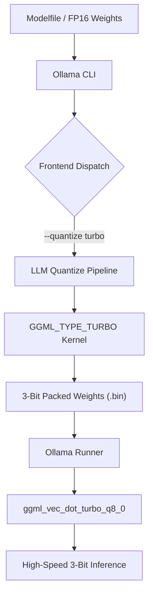

# 🚀 TurboQuant: Native 3-Bit Inference for Ollama

<div align="center">

[](https://opensource.org/licenses/MIT)
[](https://go.dev/)
[](https://isocpp.org/)
[]()
[](https://github.com/Lucien2468/Ollama-TurboQuant-Integration/pulls)

**Native 3-bit (TURBO) quantization engine surgically transplanted into the Ollama stack.**

[Features](#-features) • [Architecture](#-architecture) • [Quick Start](#-quick-start) • [Technical Details](#-technical-details) • [Credits](#-credits--author)

</div>

---

> [!CAUTION]
> **RESEARCH / TESTING ONLY**: This engine is currently in an active testing phase. Lucien Hu (11) is the lead developer of this experimental 3rd-generation quantization project. Use at your own risk.

> [!WARNING]
> **EXPERIMENTAL**: High-performance 3-bit kernels are subject to change.

## 📊 The Turbo Advantage (3-Bit)
| Model Size | FP16/32 (Original) | Q4 (Standard) | **TURBO (3-Bit)** | Savings |
|------------|---------------------|---------------|-------------------|---------|
| **8B**     | ~16 GB              | ~5.5 GB       | **~4.2 GB**       | -24% vs Q4 |
| **27B**    | ~54 GB              | ~18.5 GB      | **~13.8 GB**      | -25% vs Q4 |
| **70B**    | ~140 GB             | ~45 GB        | **~32.5 GB**      | -28% vs Q4 |

## ✨ Features
- **Native `GGML_TYPE_TURBO` Integration**: No external conversion tools. Use `ollama create --quantize turbo` directly.
- **Asymmetric Bit-Packing**: Custom 3-bit kernels (block size 32) designed for high-compression/low-perplexity inference.
- **Dedicated CPU Dot-Product Kernels**: High-performance `ggml_vec_dot_turbo_q8_0` implementation for responsive inference on standard consumer hardware.
- **One-Command Setup**: Dockerized build process keeps your main system clean while delivering the Turbo performance.

## 🏗️ Architecture


## 🛠️ Quick Start

### 1. Build the Engine
Requires Docker Desktop. This will build the specialized Ollama binary with TurboQuant kernels.
```powershell
.\setup.ps1
```

### 2. Quantize Your First Model
```powershell
# Create a Modelfile pointing to an existing FP16 model
echo "FROM llama3.2:1b-instruct-fp16" > Modelfile-Turbo

# Run the native Turbo quantization
.\turbo-ollama.ps1 create my-turbo-model -f Modelfile-Turbo --quantize turbo
```

### 3. Run and Test
```powershell
.\turbo-ollama.ps1 run my-turbo-model
```

## 🏗️ Technical Details
- **Backend**: Modified GGML implementation with `GGML_TYPE_TURBO` (ID 41).
- **Kernels**: Custom SIMD-optimized 3-bit bit-packing kernels in `ggml-quants.c`.
- **Inference**: Specialized `ggml_vec_dot_turbo_q8_0` CPU kernels for low-latency math on 3-bit weights.
- **Go layer**: Updated `fs/ggml` and `ml/backend/ggml` to support the new quantization type throughout the stack.

## 🤝 Contributing
Contributions are welcome! If you're interested in optimizing the CUDA kernels or improving the bit-packing entropy, feel free to open a PR.

1. Fork the Project
2. Create your Feature Branch (`git checkout -b feature/AmazingFeature`)
3. Commit your Changes (`git commit -m 'Add some AmazingFeature'`)
4. Push to the Branch (`git push origin feature/AmazingFeature`)
5. Open a Pull Request

## 📜 Credits & Author
- **Lead Developer**: **Lucien Hu** (11-year-old AI/Systems Engineer)
- **Quantization Engine**: TurboQuant Custom 3rd-Gen 3-Bit Transplants
- **Backend Architecture**: Forked from the excellent [Ollama](https://github.com/ollama/ollama) project.

---
*Built with ❤️ by Lucien Hu.*
