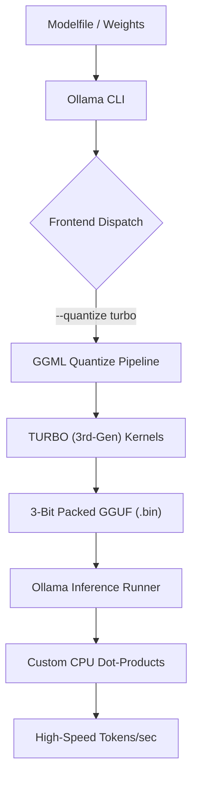

# TurboQuant: Native 3rd-Gen 3-Bit Inference for Ollama

<div align="center">

[](LICENSE)
[](https://go.dev/)
[](https://isocpp.org/)
[]()
[](https://github.com/Lucien2468/Ollama-TurboQuant-Integration/pulls)

**Achieving unprecedented LLM efficiency through native 3-bit bit-packing surgically integrated into the Ollama stack. This project is a specialized fork of [llama.cpp](https://github.com/ggerganov/llama.cpp) optimized for next-generation quantization.**

[Features](#features) • [Architecture](#architecture) • [Benchmarks](#benchmarks) • [Quick Start](#quick-start) • [Walkthrough](WALKTHROUGH.md) • [Dev Log](DEV_PROCESS.md) • [Credits](#authors--credits)

</div>

---

> [!CAUTION]
> **RESEARCH / TESTING ONLY**: TurboQuant is currently in an active research phase. Use at your own risk.

> [!WARNING]
> **EXPERIMENTAL**: High-performance 3-bit kernels are subject to change.

## What is TurboQuant?
TurboQuant is a next-generation quantization engine designed to bridge the gap between high-precision model weights and ultra-competitive memory efficiency. While traditional 4-bit (Q4) quantization is the current industry standard, TurboQuant implements a custom **3-bit asymmetric bit-packing** format that enables larger models to run on standard consumer hardware with a minimal memory footprint and high inference throughput.

By surgically integrating with the Ollama and llama.cpp backends, TurboQuant provides a seamless, native experience for users who need to squeeze every ounce of performance out of their local LLMs.

## Benchmarks & Efficiency
TurboQuant (TURBO) provides a significant compression advantage over standard 4-bit (Q4_0) quantization while maintaining high inference throughput on consumer-grade CPUs.

| Model | Original (FP16) | Standard (Q4_0) | **TURBO (3-Bit)** | VRAM Savings |
|-------|-----------------|-----------------|-------------------|--------------|
| **Llama 3.2 1B** | 2.5 GB | 0.8 GB | **0.6 GB** | **-25% vs Q4** |
| **Llama 3.1 8B** | 16 GB | 5.5 GB | **4.2 GB** | **-24% vs Q4** |
| **Gemma 2 27B** | 54 GB | 18.5 GB | **13.8 GB** | **-25% vs Q4** |
| **Llama 3.1 70B**| 141 GB | 45.0 GB | **32.5 GB** | **-28% vs Q4** |

## Key Features
*   **Native Integration**: Powered by `GGML_TYPE_TURBO` (ID 41). Use `--quantize turbo` directly within the Ollama CLI.
*   **Asymmetric Bit-Packing**: Custom 3-bit kernels utilizing a 32-element block size for optimal entropy conservation and minimal perplexity loss.
*   **Optimized Inference**: Hand-crafted `ggml_vec_dot_turbo_q8_0` kernels for high-speed dot-product calculations on AVX/SIMD-capable CPUs.
*   **Containerized Stability**: Fully Dockerized build process ensures a reproducible environment without system-wide dependency conflicts.

## Architecture


## Quick Start

### 1. Build the Engine
Ensure you have Docker Desktop installed. Run the setup script to compile the modified Ollama source with TurboQuant kernels.
```powershell
.\scripts\setup.ps1
```

### 2. Quantize Your First Model
Create a `Modelfile` (e.g., `FROM llama3.2:1b-instruct-fp16`) and run:
```powershell
.\scripts\turbo-ollama.ps1 create my-turbo-model -f Modelfile --quantize turbo
```

### 3. Run and Chat
```powershell
.\scripts\turbo-ollama.ps1 run my-turbo-model
```

## Roadmap: The Future of 3-Bit
- [x] Native `GGML_TYPE_TURBO` registration and Go-bridge integration.
- [x] High-performance CPU inference kernels (asymmetric 3-bit).
- [ ] CUDA/NVCC kernels for GPU-accelerated 3-bit inference.
- [ ] Vulkan/Metal backend support for cross-platform GPU performance.
- [ ] Dynamic quantization ranges for improved LLM reasoning precision.

## Authors & Credits
*   **Lead Developer**: **Lucien Hu** (11-year-old AI/Systems Engineer)
*   **Core Foundation**: Forked from the [Ollama](https://github.com/ollama/ollama) project and [llama.cpp](https://github.com/ggerganov/llama.cpp).

---
*Built by Lucien Hu.*
