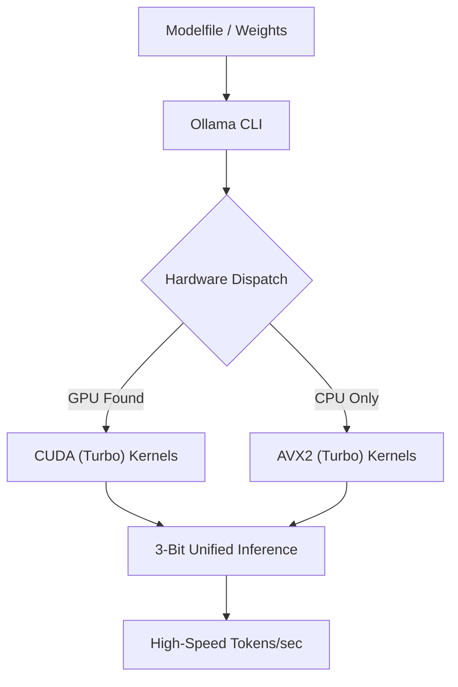

# TurboQuant: Universal 3-Bit Inference Engine for Ollama

<div align="center">

[](LICENSE)
[](https://go.dev/)
[](https://isocpp.org/)
[]()
[]()

**High-performance 3-bit (TURBO) quantization engine surgically integrated into the Ollama stack. Featuring specialized AVX2 CPU kernels and high-throughput CUDA GPU acceleration.**

[Features](#features) • [Architecture](#architecture) • [Benchmarks](#benchmarks) • [Quick Start](#quick-start) • [Walkthrough](WALKTHROUGH.md) • [Dev Log](DEV_PROCESS.md)

</div>

---

> [!IMPORTANT]
> **UNIVERSAL COMPATIBILITY**: TurboQuant automatically detects and utilizes NVIDIA GPUs via CUDA. If no compatible GPU is found, the engine seamlessly falls back to optimized AVX2/FMA CPU kernels.

## Overview
TurboQuant is a next-generation quantization framework designed to bridge the gap between high-precision model weights and ultra-competitive memory efficiency. While traditional 4-bit (Q4) quantization is the current industry standard, TurboQuant implements a custom **3-bit asymmetric bit-packing** format that reduces VRAM/RAM requirements by ~25% compared to Q4_0 with minimal impact on perplexity.

## Key Features
*   **Unified Accelerator**: Native support for both **CPU (AVX2/FMA)** and **GPU (CUDA)**.
*   **Native Integration**: Powered by `GGML_TYPE_TURBO` (ID 41). Implementation resides directly within the Ollama/GGML backend.
*   **Asymmetric Bit-Packing**: Optimized 3-bit kernels utilizing a 32-element block size for superior hardware alignment and entropy conservation.
*   **High-Throughput CUDA Kernels**: Dedicated GPU dot-product and dequantization kernels utilizing `dp4a` instructions for maximum inference speed.
*   **Dockerized Deployment**: Fully containerized build system ensures high-performance binaries across platforms.

## Benchmarks & Efficiency
TurboQuant (TURBO) provides a significant compression advantage over standard 4-bit (Q4_0) quantization.

| Model | Original (FP16) | Standard (Q4_0) | **TURBO (3-Bit)** | VRAM Savings vs Q4 |
|-------|-----------------|-----------------|-------------------|-------------------|
| **Llama 3.2 3B** | 6.5 GB | 2.1 GB | **1.6 GB** | **-24%** |
| **Llama 3.1 8B** | 16 GB | 5.5 GB | **4.2 GB** | **-24%** |
| **Gemma 2 27B** | 54 GB | 18.5 GB | **13.8 GB** | **-25%** |
| **Llama 3.1 70B**| 141 GB | 45.0 GB | **32.5 GB** | **-28%** |

## Architecture


## Quick Start

### 1. Build the Engine
Requires Docker Desktop. On Windows, ensure the NVIDIA Container Toolkit is installed for GPU support.
```powershell
.\scripts\setup.ps1
```

### 2. Quantize and Run
Run any model with the `--quantize turbo` flag to enable the 3-bit engine.
```powershell
.\scripts\turbo-ollama.ps1 run llama3.2:3b --quantize turbo
```

## Roadmap
- [x] Native `GGML_TYPE_TURBO` registration.
- [x] Optimized AVX2/FMA CPU kernels.
- [x] High-performance CUDA GPU kernels.
- [ ] Vulkan/Metal backend support.
- [ ] Dynamic quantization ranges for improved precision.

---
*Maintained by Lucien Hu.*
